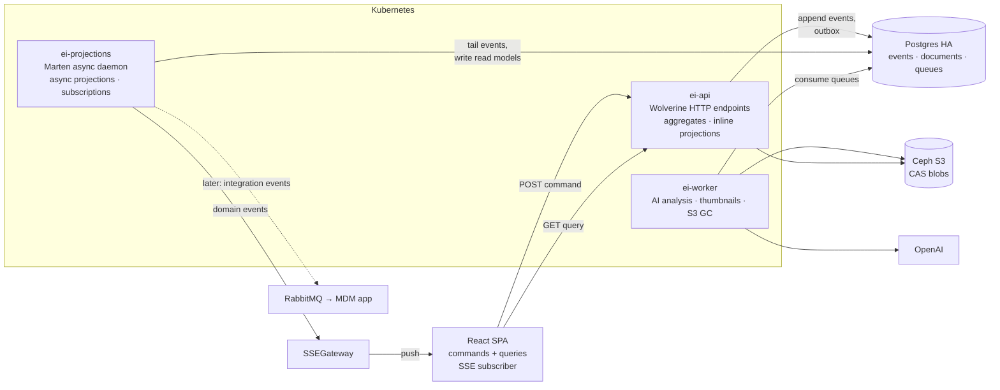
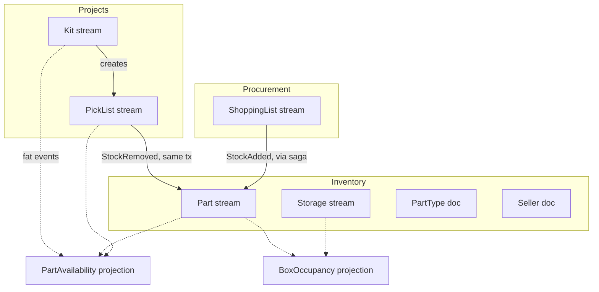

# Rebuilding Electronics Inventory as an event-sourced system

*An end-to-end exploration: what full adoption of event sourcing, CQRS and messaging looks like in this app, on Postgres with Marten and Wolverine, deployed on Kubernetes — and what a second app (the MDM one) can borrow from it.*

> Status: exploration, 2026-08-19. Written against the current repo (Flask backend, React frontend, Postgres, Ceph S3, SSEGateway, OIDC). Code samples target .NET 10 / Marten 9 / Wolverine 6 (current at time of writing); the API names used were checked against the official docs on 2026-08-19, but the samples are "the shape", not copy-paste — the Critter Stack moves fast and renames things between majors.

---

## 0. Why this document exists

The app is feature complete, used daily, covered by a browser-level test suite, and small enough to hold in one head. That makes it a rare thing: a real application you can rebuild on a different architectural foundation without the rebuild being the risk. The goal is not a better inventory app. The goal is a **testbed** — a place to learn what event sourcing, CQRS, eventual consistency and messaging actually feel like end to end, with real data, a real user (you), real infrastructure (your Postgres HA cluster, Ceph, Kubernetes), and an existing system to compare against.

Three constraints shape everything below:

1. **Don't force the domain.** Where a piece of the app is plain master data, it stays plain. The interesting question is where the boundary goes and how the two halves talk.
2. **Postgres is the store.** Not because it's optimal for event sourcing but because the HA cluster exists, and at this volume "optimal" is noise. This is the decisive argument for Marten.
3. **It's a testbed for more than one app.** Patterns should transfer to the MDM app and whatever comes next; that biases towards a modular layout with one clear host/role split rather than bespoke choices per feature.

The short form of the conclusions:

| Question | Answer |
|---|---|
| Backend | C# / .NET 10, ASP.NET Core |
| Event store + document store | Marten on the existing Postgres cluster |
| Command handling, messaging, sagas, outbox | Wolverine (same authors as Marten — the "Critter Stack") |
| Broker | None to start (Wolverine's Postgres transport); RabbitMQ when a second app needs to listen |
| CQRS | Yes — intrinsic once state is events; consistency per projection is a dial (inline vs async), not a religion |
| Frontend | Keep the screens and the Playwright suite, rewrite the data layer around commands + SSE |
| Kubernetes | One image, three roles (api / projections / worker), rebuilds as Jobs, projection lag as a health signal |
| Master data | Documents with optimistic concurrency, *event-driven* (publish change notifications) but not *event-sourced* |

---

## 1. Vocabulary, briefly

Because these words get used loosely:

- **Event sourcing (ES)**: the source of truth for an entity is the ordered list of things that happened to it (its *stream*). Current state is computed by folding the events. You never `UPDATE` the truth; you append.
- **Aggregate**: the consistency boundary — the unit whose invariants are checked inside one transaction against one stream. ("A Part's stock per location can't go negative.")
- **Command**: a request to change something (`RemoveStock`). Can be rejected.
- **Event**: a fact that happened (`StockRemoved`). Cannot be rejected, only compensated.
- **Projection / read model**: a view computed from events, stored as a document or table, optimised for a query. The thing your list pages read.
- **CQRS**: the observation that once writes go through aggregates and reads go through projections, the two sides have different models and can be served by different code, processes, even machines. It does *not* require asynchrony.
- **Eventual consistency**: when a projection is updated after the transaction that appended the events, there's a window where a read returns stale data. Small, but the UI has to be designed for it.
- **Event-driven (not the same as event-sourced)**: components react to published events, but the publisher's own truth may still be a normal row. Master data here will be event-driven without being event-sourced.
- **Process manager / saga**: a stateful coordinator that listens to events and issues commands to drive a multi-step workflow to completion (including compensation on failure).
- **Outbox**: writing outgoing messages in the same transaction as the state change so "state changed but message lost" cannot happen.

---

## 2. Marten in twenty minutes

Marten is a .NET library (not a server) that turns Postgres into two things at once:

1. a **document database** — POCOs serialised to `jsonb`, one table per document type, with identity, indexes, LINQ querying, optimistic concurrency, soft deletes, full-text search and multi-tenancy; and
2. an **event store** — append-only streams of events with versions, a global sequence, metadata, and a projection engine that turns events into documents (or anything else) either synchronously in the same transaction or asynchronously in a background daemon.

Everything is plain Postgres tables in one schema, so it sits next to anything else in the same database and inherits the HA cluster's behaviour. There is no extra process to operate except the ones *you* run. (Since Marten 9 there is also no runtime code generation step — earlier versions wanted a `codegen write` pass for cold-start performance; that wrinkle is gone, which simplifies container images.)

### 2.1 Documents

```csharp
public sealed class Seller
{
    public Guid Id { get; set; }           // convention: Id / <Type>Id property is the identity
    public string Name { get; set; } = "";
    public string? Website { get; set; }
    public int Version { get; set; }       // numeric revision for optimistic concurrency
}

// Registration
builder.Services.AddMarten(opts =>
{
    opts.Connection(connectionString);
    opts.DatabaseSchemaName = "ei";
    opts.Schema.For<Seller>()
        .UseNumericRevisions(true)                // Version is bumped by Marten; stale writes throw
        .Index(x => x.Name, i => i.IsUnique = true);
})
.UseLightweightSessions();                        // no change tracking by default (explicit Store())
```

```csharp
// Use
await using var session = store.LightweightSession();
var seller = new Seller { Id = Guid.NewGuid(), Name = "Mouser" };
session.Store(seller);
await session.SaveChangesAsync();                 // one transaction

var mousers = await session.Query<Seller>()
    .Where(s => s.Name.StartsWith("Mou"))
    .ToListAsync();
```

Things worth knowing:

- **Sessions are units of work.** `IQuerySession` is read-only; `IDocumentSession` batches stores/deletes/event appends and commits them in one transaction on `SaveChangesAsync()`. The lightweight session is the right default; identity-map and dirty-tracking sessions exist for ORM-style workflows.
- **Schema is derived from your types and options** and can be applied at startup (`ApplyAllDatabaseChangesOnStartup()`) or through the CLI (`db-apply`, `db-patch`). No hand-written migrations for the store itself — a nice contrast to the 22 Alembic revisions.
- **Indexes are declared in code**: duplicated columns for hot fields, computed indexes, unique indexes, GIN full-text (`FullTextIndex(...)`) and n-gram indexes for "type anything" search.
- **Queries are LINQ** over the JSON, plus raw SQL escape hatches and *compiled queries* for hot paths.

For this app, documents are what master data and read models become.

### 2.2 The event store

```csharp
// Events are plain records. Immutable, serialisable, named in the past tense.
public sealed record PartCreated(Guid PartId, string Key, string Description, Guid? TypeId, DateTimeOffset OccurredAt);
public sealed record StockAdded(Guid PartId, LocationRef Location, int Qty, DateTimeOffset OccurredAt);
public sealed record StockRemoved(Guid PartId, LocationRef Location, int Qty, DateTimeOffset OccurredAt);

// Start a stream
session.Events.StartStream<Part>(partId, new PartCreated(partId, "BZQP", "5V relay", relayTypeId, now));
await session.SaveChangesAsync();

// Append to it
session.Events.Append(partId, new StockAdded(partId, new LocationRef(7, 3), 120, now));
await session.SaveChangesAsync();
```

Under the hood: a `mt_streams` row per stream (id, type, current version) and a `mt_events` row per event (stream id, version within the stream, **global sequence number**, type name, JSON body, timestamp, and optional correlation id / causation id / headers). The global sequence is what projections and subscriptions track their progress against.

One setting to know about up front: `opts.Events.AppendMode`. `Quick` (the default in current versions) lets Postgres assign sequence numbers at insert, which is faster but means your code doesn't know the sequence of what it just appended until it reads it back; `Rich` reserves sequence numbers client-side before the commit. §7.2 relies on knowing the sequence, so the API role runs `Rich`. At this volume the difference is unmeasurable.

Reading back:

```csharp
// The whole raw stream
var events = await session.Events.FetchStreamAsync(partId);

// A live aggregation: fold the events into a Part right now (no storage involved)
var part = await session.Events.AggregateStreamAsync<Part>(partId);

// Time travel: the Part as it was at version 12, or at a timestamp
var earlier = await session.Events.AggregateStreamAsync<Part>(partId, version: 12);
var lastMarch = await session.Events.AggregateStreamAsync<Part>(partId, timestamp: new DateTime(2026, 3, 1));

// The latest state, from the stored snapshot if there is one, live-folded if not
var latest = await session.Events.FetchLatest<Part>(partId);
```

And the one you use in command handlers:

```csharp
// Load for writing: fetches the aggregate (from snapshot or live) AND remembers the version,
// so the append fails with a concurrency exception if someone else got there first.
var stream = await session.Events.FetchForWriting<Part>(partId);
var part = stream.Aggregate!;                     // current state
stream.AppendOne(new StockRemoved(...));          // decide, append
await session.SaveChangesAsync();                 // version-checked commit
```

`FetchForExclusiveWriting` does the same with a row lock, for the rare case where you want pessimism.

### 2.3 Aggregates are just folds

Marten doesn't care what your aggregate looks like; by convention it finds `Create(event)` and `Apply(event)` methods (or `static Create`) and calls them in order. That convention is the whole "aggregate" story:

```csharp
public sealed class Part
{
    public Guid Id { get; set; }
    public string Key { get; private set; } = "";
    public string Description { get; private set; } = "";
    public List<StockAtLocation> Stock { get; private set; } = new();
    public int Total => Stock.Sum(s => s.Qty);

    public static Part Create(PartCreated e) => new() { Id = e.PartId, Key = e.Key, Description = e.Description };

    public void Apply(StockAdded e)
    {
        var at = Stock.FirstOrDefault(s => s.Location == e.Location);
        if (at is null) Stock.Add(new StockAtLocation(e.Location, e.Qty));
        else at.Qty += e.Qty;
    }

    public void Apply(StockRemoved e)
    {
        var at = Stock.First(s => s.Location == e.Location);
        at.Qty -= e.Qty;
        if (at.Qty == 0) Stock.Remove(at);        // "zero clears the location" is structural, not an event
    }

    public void Apply(StockMoved e) { Apply(new StockRemoved(e.PartId, e.From, e.Qty, e.OccurredAt)); Apply(new StockAdded(e.PartId, e.To, e.Qty, e.OccurredAt)); }
}
```

Note what *isn't* here: no validation, no decisions, no dependencies. Folding must be total — it can never fail, because the events already happened. Decisions live in the command handler (§4.1).

### 2.4 Projections — and the lifecycle dial

This is the part that matters most for the testbed. A projection is anything that consumes events and produces something. Marten ships four shapes and three lifecycles:

| Shape | What it does | Typical use here |
|---|---|---|
| **Single-stream** (aggregate/snapshot) | one document per stream, folded from that stream's events | `Part`, `Kit`, `PickList`, `ShoppingList` snapshots |
| **Multi-stream** | one document per *some key*, fed by events from many streams; you tell it how to extract the key (`Identity<TEvent>(e => e.PartId)`) | part availability (Part + Kit + PickList events), box occupancy |
| **Event projection** | arbitrary: for each event, store/delete any documents, run SQL | dashboard counters, search index upkeep |
| **Custom** (`IProjection`) | you get batches of events and a session; do anything | bulk upserts, exotic targets |

| Lifecycle | When it runs | Consistency | Cost |
|---|---|---|---|
| **Inline** | in the same transaction as the append | immediate — read your own writes | the command pays for it |
| **Async** | by the projection daemon, shortly after | eventual | the command is faster; UI must cope with lag |
| **Live** | on demand at query time, nothing stored | immediate, but recomputed per query | fine for small streams |

```csharp
opts.Projections.Snapshot<Part>(SnapshotLifecycle.Inline);                 // Part document kept in step with the stream
opts.Projections.Add<PartAvailabilityProjection>(ProjectionLifecycle.Async);
opts.Projections.Add<DashboardProjection>(ProjectionLifecycle.Async);
```

The reason this is the ideal testbed: **you can change a projection from Inline to Async with one line, redeploy, and watch what it does to the UI.** Every eventual-consistency experiment you want to run is that line plus the UI work to cope.

### 2.5 The async daemon

Async projections (and subscriptions, below) are run by the *async daemon*: a hosted service that tails `mt_events` by global sequence, hands batches to each projection, and records each projection's high-water mark in a progress table. It is:

- **rebuildable**: delete a projection's documents and replay from sequence 0 (`dotnet run -- projections rebuild` from the CLI, or `daemon.RebuildProjectionAsync<T>(timeout, ct)` in code). At your volume a full rebuild is seconds.
- **HA-aware**: `DaemonMode.Solo` for one node; `DaemonMode.HotCold` for several, where nodes take a Postgres advisory lock and exactly one runs each projection while the others stand by. With Wolverine there's a richer option that *distributes* projections across nodes and supports blue/green projection versions (`[ProjectionVersion(2)]` on the new version, old and new run side by side until you switch).
- **observable**: the progress table (`mt_event_progression`) *is* your lag metric (`last event sequence − projection sequence`); `Marten.AspNetCore` ships `AddMartenAsyncDaemonHealthCheck(maxEventLag: …)`, which turns lag into a Kubernetes probe.

### 2.6 Subscriptions

A subscription is "a projection that doesn't produce documents": a consumer that receives events in order from the daemon and does side effects — publish to a message bus, push to the SSE gateway, call an external system. Same progress tracking, same rebuild semantics (you usually *don't* rebuild those). This is the hook for "something happened → tell the UI / tell the MDM app".

### 2.7 Metadata, versioning, archiving

- **Correlation/causation** ids, user name and arbitrary headers are opt-in per store (`opts.Events.MetadataConfig.CorrelationIdEnabled = true` etc.); set `session.CorrelationId` / `session.CausationId` before appending and every event in that unit of work carries them. When left unset they're populated from the current OpenTelemetry `Activity`, so with tracing on you get trace-correlated events for free. This is how `KitPickListLine.inventory_change_id` becomes a first-class link: the `StockRemoved` event's causation id *is* the `LinePicked` event's id.
- **Timestamps**: the store stamps each event at append time. For imports you can override that (`myEvent.AsEvent().AtTimestamp(originalTime)` — check the append-mode caveats on the metadata docs page), but §8 argues for carrying `OccurredAt` in the payload regardless.
- **Event type names** are strings in the table; `MapEventType<T>("stock_added")` pins them so a C# rename doesn't break replay.
- **Upcasting**: when an event's shape must change, register `opts.Events.Upcast<StockAddedV1, StockAdded>(old => new StockAdded(...))` (or a class deriving from `EventUpcaster<TOld, TNew>`); old rows are transformed on read. You keep the old record type around, forever. (This is the one place ES genuinely costs you ongoing discipline.)
- **Archiving**: `ArchiveStream(id)` marks a stream cold; with partitioning enabled the hot table stays small. Not needed here, but it's how "the part itself is never deleted" coexists with tidy tables.

### 2.8 How this maps to KurrentDB

KurrentDB (EventStoreDB's name since the 25.0 release in March 2025; .NET client `KurrentDB.Client`) is a purpose-built event store *server*. Conceptually everything above has a counterpart:

| Marten | KurrentDB | Notes |
|---|---|---|
| `mt_events` global sequence | `$all` stream | same idea |
| stream type + id | stream name (`part-BZQP`) and `$by_category` | Kurrent's category projections are implicit; Marten's are your multi-stream projections |
| async daemon + projections | catch-up subscriptions + *your* projector process writing to *some other database* | Kurrent has no document store; read models live in Postgres/Mongo/Raven |
| subscriptions | persistent subscriptions (competing consumers) | Kurrent has server-side consumer groups; Marten leaves fan-out to Wolverine |
| inline projections | n/a | immediate consistency needs an extra mechanism; eventual is the default posture |
| same-transaction multi-stream append | n/a (one stream per append; multi-stream needs sagas) | the single biggest practical difference for this app |
| `jsonb` in Postgres | native log-structured storage | performance — irrelevant at this scale |

Your instinct is right: Kurrent + Mongo is the more "pure" shape, teaches you the distributed version of every problem, and buys nothing functional here while costing two stateful services and a lot of outbox/idempotency plumbing you'd have to write yourself. Marten lets you *choose* purity per feature (make projections async, route a flow through a saga) and otherwise get on with it. If later you want to feel the difference, the domain code (events, aggregates, deciders) is store-agnostic by construction and could be re-hosted on Kurrent as an exercise.

---

## 3. Target architecture



Three runtime roles built from **one image**, selected by an environment variable:

| Role | Runs | Replicas | Notes |
|---|---|---|---|
| `api` | HTTP endpoints, command handlers, inline projections, Wolverine outbox | 2 | stateless; scale for availability, not load |
| `projections` | Marten async daemon (async projections, subscriptions), Wolverine durable inbox | 1 (or 2 HotCold) | this is where eventual consistency *happens* |
| `worker` | queue consumers: AI analysis saga steps, thumbnail generation, orphan-blob GC | 1+ | the only role that calls OpenAI |

Shared infrastructure is what you already run: the Postgres cluster (events, documents, Wolverine's queues and saga state — *one* cluster, *one* backup story), Ceph for blobs, the SSEGateway for push, Keycloak-style OIDC for auth.

Inside the code, one solution, one domain, split by *layer* not by deployment:

```
src/
  EI.Domain          events, aggregates, deciders, value types     (no Marten/Wolverine references — pure C#)
  EI.Application     command handlers, projections, sagas, subscriptions, read-model queries
  EI.Host            the single ASP.NET host; ROLE=api|projections|worker decides what it wires up
  EI.Import          one-shot importer from the old schema (a console command in the same host)
tests/
  EI.Domain.Tests        given/when/then on aggregates — milliseconds, no database
  EI.Application.Tests   Marten against Testcontainers Postgres — projections, handlers, sagas
  EI.Host.Tests          HTTP contract tests with Alba
```

Why not split by bounded context into separate services ("take advantage of Kubernetes")? See §10 — the honest answer is "do it once, for one context, deliberately", because the lessons of distribution come from the *process boundary* (outbox, at-least-once, idempotency, ordering), and you already get three process boundaries from the role split. Splitting everything would multiply deployment overhead without new lessons; splitting one thing teaches you integration events and anti-corruption layers for real, and sets up the MDM app as a second genuine consumer.

---

## 4. Carving up the domain

### 4.1 The rule for what gets event-sourced

Event-source a thing when at least two of these are true: it has a **lifecycle** (state transitions that matter), its **history is useful** (you'd ask "what was it / where was it when"), it has **invariants** worth a transactional boundary, or it is **what the user actually does** (as opposed to what they configure). Otherwise it's a document.

| Today (tables) | Tomorrow | Why |
|---|---|---|
| `parts`, `part_locations`, `quantity_history`, `part_sellers`, part `attachment_sets`/`attachments` | **`Part` stream** | lifecycle, history (the thing you'd time-travel on), invariants (stock ≥ 0, can't delete with stock), and it's where 80 % of user actions land |
| `boxes`, `locations` | **`Storage` stream** — a single global stream of `BoxAdded / BoxResized / BoxRemoved` | tiny, owns box numbering (uniqueness inside one aggregate — no cross-stream problem), layout history is mildly interesting; occupancy is a projection |
| `types` | **`PartType` document** | master data; rename/merge are edits, not history |
| `sellers` | **`Seller` document** | master data |
| `kits`, `kit_contents`, kit attachments | **`Kit` stream** | lifecycle (active/archived), BOM edits are worth a history |
| `kit_pick_lists`, `kit_pick_list_lines` | **`PickList` stream** (one per pick list, created by a Kit command) | own lifecycle, lines flip state, ties to stock events |
| `shopping_lists`, `shopping_list_lines`, `shopping_list_sellers`, `kit_shopping_list_links` | **`ShoppingList` stream** | lifecycle per line (new→ordered→done), receiving ties to stock, reconciliation (`completion_mismatch`) is inherently an event-shaped story |
| kit reservations (computed) | **`PartAvailability` projection** (multi-stream) | stays derived, formalised |
| parts list with totals/badges, dashboard, box usage, parts-without-docs, kit detail availability, search | **projections** (documents) | the read side |
| S3 CAS blobs, thumbnail cache | unchanged | already content-addressed and derived |
| `quantity_history` | gone — *it is the event stream now* | |
| task registry, SSE manager | Wolverine messages/sagas + an SSE subscription | |

Two judgement calls worth explaining:

**Part metadata in the stream, not a document.** One could split "Part description/type/tags" (document) from "Part stock" (stream). I'd keep them together: creating a part with initial stock is one user action and should be one command; "what did this part look like when I bought it" is cheap to answer if it's in the stream; and the stream stays small (tens to low hundreds of events per part over years). The cost is that a description edit is an event — which is fine as long as you don't model it as `PartUpdated { whole part }` (see §9).

**Storage as one stream instead of `Box` documents.** Boxes could be documents, and if you had thousands it would be the answer. You have a handful. A single `Storage` aggregate that owns all boxes makes box numbering and "no gaps, sequential" a local invariant, and `BoxResized` carries the old and new capacity so the occupancy projection knows which locations vanished. It also models reality: your shelf *is* one thing.

### 4.2 Commands versus "posting events from the UI"

You said you'd like to "really post events from the UI". There's a real design decision hiding there, and inventory is the domain where it's most legitimate.

In strict ES the UI sends **commands**, the aggregate decides, events come out. The UI never authors events, because only the aggregate knows whether the thing is allowed. But think about what the user at the bench is actually doing when they tap "−5 from 7-3": they are **reporting a fact about the physical world**. The parts are already gone. If the server says "no, you only had 3", the server is wrong, not the user. Inventory commands are mostly *assertions*, and the right response to an inconsistency is to record a correction, not reject the report.

So the design I'd suggest:

- The UI sends commands, but they are *phrased and treated as facts*: `RecordStockRemoved`, `RecordItemsPicked`, `RecordShipmentReceived`. The aggregate's job is to check *consistency* (does the location exist, is this part known), enrich (fill totals, timestamps), and append — not to second-guess reality.
- When the report contradicts the model (remove 5 from a location holding 3), the aggregate emits **two** events: `StockRemoved(3)` and `StockCountCorrected(location, expected: 3, actual: 5, delta: +2)` — or rejects, depending on a per-command policy you choose. Either is defensible; recording the correction is more honest and gives you a "discrepancies" projection for free. The shopping list's `completion_mismatch` field is this idea already, hand-rolled.
- The UI generates the **command id** (a ULID — the frontend already depends on `ulid`) and the **`OccurredAt`** timestamp. The command id is the idempotency key (retry-safe, offline-queue-safe); `OccurredAt` is *when it happened*, distinct from the event's stored timestamp (*when it was recorded*). Keep both — the importer (§8) will thank you.

That's as close to "posting events from the UI" as is sane: the UI authors the fact; the server authors the event.

### 4.3 Where the consistency boundaries land



Two cross-stream writes survive, and they're handled differently on purpose so you get to compare:

- **Pick / undo** (PickList ↔ Part): atomic, two streams appended in one Marten transaction (§5.3). Rationale: it's one physical act and one tap.
- **Receive shipment** (ShoppingList ↔ Part): eventually consistent through a saga (§5.5). Rationale: it's genuinely a process (receive, allocate across locations, confirm), and it's the gentlest place to *learn* sagas.

---

## 5. Worked examples

Each example shows today's code path and what replaces it.

### 5.1 Adding stock

**Today**: `InventoryService.add_stock` (`backend/app/services/inventory_service.py:56`) loads the `Location`, upserts a `PartLocation` row, inserts a `QuantityHistory` row, bumps a Prometheus counter, all in the request's SQLAlchemy session.

**Tomorrow**, in three pieces.

The command and the decision (pure domain, no framework):

```csharp
public sealed record AddStock(Guid CommandId, Guid PartId, LocationRef Location, int Qty, DateTimeOffset OccurredAt);

public static class PartDecider
{
    public static StockAdded Decide(Part part, AddStock cmd, Storage storage)
    {
        if (cmd.Qty <= 0) throw new DomainException("quantity must be positive");
        if (!storage.Exists(cmd.Location)) throw new DomainException($"location {cmd.Location} does not exist");
        return new StockAdded(part.Id, cmd.Location, cmd.Qty, cmd.OccurredAt);
    }
}
```

The handler (Wolverine's *aggregate handler workflow*; the attribute tells Wolverine to load the `Part` via `FetchForWriting`, append whatever the method returns, and commit):

```csharp
public static class AddStockHandler
{
    public static async Task<StockAdded> Handle(
        AddStock cmd,
        [WriteAggregate] Part part,                 // loaded by PartId, version-checked on commit
        IQuerySession query)
    {
        var storage = await query.Events.FetchLatest<Storage>(Storage.SingletonId);
        return PartDecider.Decide(part, cmd, storage);
    }
}
```

Without Wolverine the same thing is a few lines of Marten:

```csharp
await using var session = store.LightweightSession();
session.CorrelationId = cmd.CommandId.ToString();
var stream = await session.Events.FetchForWriting<Part>(cmd.PartId, ct);
stream.AppendOne(PartDecider.Decide(stream.Aggregate!, cmd, storage));
await session.SaveChangesAsync(ct);
```

And the read side. Inline snapshot keeps the `Part` document current in the same transaction (so the part detail page is never stale); the parts list and the box occupancy are async projections:

```csharp
opts.Projections.Snapshot<Part>(SnapshotLifecycle.Inline);

public sealed class BoxOccupancy { public int Id { get; set; } /* box no */ public int Capacity { get; set; } public Dictionary<int, OccupiedBy> Locations { get; set; } = new(); }

public sealed class BoxOccupancyProjection : MultiStreamProjection<BoxOccupancy, int>
{
    public BoxOccupancyProjection()
    {
        Identity<BoxAdded>(e => e.BoxNo);
        Identity<BoxResized>(e => e.BoxNo);
        Identity<StockAdded>(e => e.Location.BoxNo);
        Identity<StockRemoved>(e => e.Location.BoxNo);
        Identities<StockMoved>(e => new[] { e.From.BoxNo, e.To.BoxNo }.Distinct().ToList());
    }
    public void Apply(BoxAdded e, BoxOccupancy box) { box.Capacity = e.Capacity; }
    public void Apply(StockAdded e, BoxOccupancy box) => box.Occupy(e.Location.LocNo, e.PartId, e.Qty);   // who is there, how many; the part key is joined at query time (or carried on the event — §5.4)
    public void Apply(StockRemoved e, BoxOccupancy box) { /* decrement; remove at zero */ }
    // ...
}
```

What you lost: one `UPDATE` and one `INSERT`. What you gained: the history is the truth (no more "history says X but the row says Y"), correlation to the command, and the choice of which views are immediate.

### 5.2 Part keys and other "no two may share" rules

**Today**: `part_service.py:29-42` generates a random 4-letter key and retries on collision against a unique column. Names of types/sellers/kits/lists are unique columns too.

An aggregate can't know what other streams contain, so uniqueness is a **set-based** rule — the textbook ES awkwardness. Three ways out, from simplest to purest:

1. **Unique index on an inline projection.** The `Part` snapshot document has `Key` with `Index(x => x.Key, i => i.IsUnique = true)`. Because the snapshot is inline, the document insert is in the *same transaction* as `StartStream`; a collision surfaces as a Marten exception wrapping Postgres's unique violation, the transaction rolls back, the handler retries with a fresh key. This is the one to use. Same trick for kit/list/type/seller names.
2. **Use the key as the stream id.** Marten can use string stream identities; `StartStream("part/BZQP", ...)` throws on an existing id. Elegant, but the identity mode is store-wide, and Guids are nicer everywhere else. Mentioned for completeness.
3. **A registry aggregate** (`PartKeyRegistry` stream that owns all keys). Correct in any store, including Kurrent; pointless when you have (1).

Note the general lesson: Marten's inline projections are a *consistency tool*, not only a read-model tool. They are how you get a transactional view of "the set" when you need one.

### 5.3 Picking a line: two streams, one transaction

**Today**: `KitPickListService.pick_line` (`kit_pick_list_service.py:445-493`) locks the line `FOR UPDATE`, calls `inventory_service.remove_stock`, stores the resulting `quantity_history.id` on the line, flips the line (and maybe the header) to completed. `undo_line` reverses it using that id.

**Tomorrow**: the same shape, with streams.

```csharp
public sealed record PickLine(Guid CommandId, Guid PickListId, Guid LineId, DateTimeOffset OccurredAt);

public static class PickLineHandler
{
    // Two aggregates, one unit of work. Plain Marten here because it's two FetchForWriting calls.
    public static async Task Handle(PickLine cmd, IDocumentSession session, CancellationToken ct)
    {
        session.CorrelationId = cmd.CommandId.ToString();

        var pickList = await session.Events.FetchForWriting<PickList>(cmd.PickListId, ct);
        var line = pickList.Aggregate!.RequireOpenLine(cmd.LineId);     // throws if already picked

        var part = await session.Events.FetchForWriting<Part>(line.PartId, ct);
        var removed = PartDecider.Decide(part.Aggregate!, new RemoveStock(cmd.CommandId, line.PartId, line.Location, line.Qty, cmd.OccurredAt));

        var picked = new LinePicked(cmd.PickListId, cmd.LineId, line.PartId, line.Location, line.Qty, cmd.OccurredAt);
        pickList.AppendOne(picked);
        session.CausationId = picked.Id.ToString();        // the StockRemoved is *caused by* the pick
        part.AppendOne(removed);

        await session.SaveChangesAsync(ct);                // both streams version-checked, one Postgres transaction
    }
}
```

Undo finds the `StockRemoved` by causation id (or simply re-derives it from the `LinePicked` payload) and appends `StockAdded` + `LinePickUndone`. The `inventory_change_id` column is gone; the link is metadata.

Now the interesting question: **is this cheating?** In pure ES, yes — one aggregate per transaction. Here, you're leaning on the fact that the store is one Postgres. My position: it's the right call *for this flow* because the pick is one physical act, and the alternative (choreography: `LinePicked` → handler sends `RemoveStock` → may fail → `LinePickReverted`) would make the UI show "picked" for a moment and then "oops". Do the atomic version here, and the eventual version in §5.5 where it fits. You'll have both in one codebase, which is exactly what a testbed is for.

### 5.4 Kit availability: the multi-stream projection

**Today**: `KitReservationService` (`kit_reservation_service.py`) recomputes, per request, `required_per_unit × build_target` over every ACTIVE kit, and `KitPickListService` subtracts open pick lines. Nothing is stored; `create_pick_list` reads stock without locks.

**Tomorrow**: a projection keyed by part id, fed by three streams:

```csharp
public sealed class PartAvailability
{
    public Guid Id { get; set; }              // part id
    public int OnHand { get; set; }
    public int Reserved { get; set; }         // Σ active kits
    public int OpenPicks { get; set; }        // allocated on open pick lines
    public int Available => OnHand - Reserved - OpenPicks;
    public List<KitReservation> ByKit { get; set; } = new();
}

public sealed class PartAvailabilityProjection : MultiStreamProjection<PartAvailability, Guid>
{
    public PartAvailabilityProjection()
    {
        Identity<StockAdded>(e => e.PartId);
        Identity<StockRemoved>(e => e.PartId);
        Identity<KitContentSet>(e => e.PartId);                        // a BOM line was added/changed
        Identities<KitBuildTargetChanged>(e => e.Lines.Select(l => l.PartId).ToList());
        Identities<KitArchived>(e => e.Lines.Select(l => l.PartId).ToList());
        Identities<PickListCreated>(e => e.Lines.Select(l => l.PartId).ToList());
        Identity<LinePicked>(e => e.PartId);
    }

    public void Apply(StockAdded e, PartAvailability v)   => v.OnHand += e.Qty;
    public void Apply(StockRemoved e, PartAvailability v) => v.OnHand -= e.Qty;

    public void Apply(KitBuildTargetChanged e, PartAvailability v)
    {
        var line = e.Lines.First(l => l.PartId == v.Id);
        v.Reserved += (e.NewTarget - e.OldTarget) * line.RequiredPerUnit;
    }
    // KitContentSet, KitArchived, PickListCreated, LinePicked similarly
}
```

Two things this forces you to decide, and both are real ES lessons:

**Fat events.** `KitBuildTargetChanged` carries the kit's BOM lines, because the projection needs them and a projection should not go querying other documents mid-apply (it can, but then rebuilds depend on state that may have changed). Events are facts; "the kit had these lines when the target changed" is a fact. Get used to events carrying a little more than the minimal delta.

**The race doesn't go away.** Today, planning a pick list reads stock, then `pick_line` decrements later, with nothing in between. With this projection being *async*, it's the same race plus projection lag. That's honest: availability is a *forecast*, and the aggregate that actually owns stock (`Part`) is still the one that says no. If you ever wanted to close it you'd introduce a `StockAllocation` concept inside `Part` (`StockReserved` events) — which is what a warehouse system does and what a single user doesn't need. Leave it as a projection and *document that it's a forecast* in the UI ("available (approx.)").

### 5.5 Receiving a shipment: a saga on purpose

**Today**: `ShoppingListLineService.receive_line_stock` (`shopping_list_line_service.py:324-408`) validates that allocations sum to the received quantity, then loops `add_stock` per location and increments `line.received`, in one transaction.

**Tomorrow**: a process, coordinated by a Wolverine saga, persisted in Marten, driven by messages through the outbox. This is the deliberately-eventual one.

```csharp
// Command from the UI: one tap, "I received 200 of line X, put 120 in 7-3 and 80 in 7-4"
public sealed record RecordShipmentReceived(Guid CommandId, Guid ShoppingListId, Guid LineId, int Qty, Allocation[] Allocations, DateTimeOffset OccurredAt);

// Step 1: the shopping list records the fact immediately (inline) and starts the process
public static class RecordShipmentReceivedHandler
{
    public static (Events, OutgoingMessages) Handle(RecordShipmentReceived cmd, [WriteAggregate] ShoppingList list)
    {
        var line = list.RequireReceivableLine(cmd.LineId);
        var received = new ShipmentReceived(list.Id, cmd.LineId, line.PartId, cmd.Qty, cmd.Allocations, cmd.OccurredAt);
        return ([received], [new StartStocking(cmd.CommandId, received)]);     // message goes through the outbox
    }
}

// Step 2: the saga puts the stock away, location by location, and reports back
public sealed class StockingSaga : Saga
{
    public Guid Id { get; set; }                       // = CommandId — idempotent start
    public Guid ShoppingListId { get; set; }
    public Guid LineId { get; set; }
    public HashSet<LocationRef> Pending { get; set; } = new();

    public static (StockingSaga, IEnumerable<AddStock>) Start(StartStocking msg)
    {
        var saga = new StockingSaga { Id = msg.CommandId, ShoppingListId = msg.Received.ShoppingListId, LineId = msg.Received.LineId,
                                      Pending = msg.Received.Allocations.Select(a => a.Location).ToHashSet() };
        var cmds = msg.Received.Allocations.Select(a => new AddStock(Guid.NewGuid(), msg.Received.PartId, a.Location, a.Qty, msg.Received.OccurredAt));
        return (saga, cmds);
    }

    public object? Handle(StockAdded ev)               // delivered by the Marten→Wolverine event relay (see §6.2)
    {
        Pending.Remove(ev.Location);
        if (Pending.Count > 0) return null;
        MarkCompleted();
        return new ConfirmStocked(ShoppingListId, LineId);  // → ShoppingList appends LineStocked; UI flips from "putting away…" to "done"
    }

    public object Handle(StockRejected ev)             // e.g. location was removed between allocation and stocking
    {
        MarkCompleted();
        return new FlagStockingProblem(ShoppingListId, LineId, ev.Reason);   // → ShoppingList appends StockingFailed; UI shows it
    }
}
```

What you learn from having this one flow be eventual:

- the UI *has* to show an intermediate state ("received — putting away…") and it turns out that's *better* UX than a spinner, because it's true;
- at-least-once delivery means `AddStock` must be idempotent — the command id is the dedupe key and Marten's inbox handles redelivery;
- compensation is a design problem, not a technical one: what *should* happen if a location vanished? (Probably: put it in the suggested location and tell the user.)

And you can compare, side by side, with the atomic pick flow. Your testbed now contains both answers to "what about cross-aggregate consistency", live.

### 5.6 Attachments, CAS, thumbnails

**Today**: blobs go to S3 under `cas/<sha256>`; `attachments` rows reference the key; `attachment_sets` have a circular FK for the cover; thumbnails are a file cache keyed by hash + size; S3 deletes are best-effort and orphans are GC'd separately.

**Tomorrow**: almost nothing changes in *storage*, and the schema warts vanish:

1. The UI uploads the blob first: `PUT /blobs` → the API streams it to S3 under its hash and returns `{ sha256, contentType, size }`. This is not a domain operation; a blob that nobody references is just garbage to be collected.
2. The UI sends `AttachDocument(PartId, AttachmentId, Kind, Title, Sha256?, Url?)`. The `Part` aggregate appends `AttachmentAdded`. Cover is `CoverAttachmentSet(AttachmentId?)`. Removal is `AttachmentRemoved`.
3. The `Part` snapshot carries the attachment list; the "parts without documents" dashboard number is an async event projection maintaining a single `DashboardStats` document.
4. Thumbnails stay a derived cache keyed by hash; a `worker` handler warms them on `AttachmentAdded` (a subscription publishes `AttachmentAdded` to a queue).
5. Orphan GC becomes a scheduled Wolverine message (`SweepOrphanBlobs`, daily) that diffs S3 keys against a `BlobReferences` projection. Rebuilding that projection is how you'd recover if you ever doubted it.

Polymorphism (`url` vs `image` vs `pdf`) becomes three event shapes or one event with a discriminated payload; since events are JSON, the nullable-column smell is gone either way.

### 5.7 Resizing a box

**Today**: `BoxService.update_box_capacity` (`box_service.py:101-111`) deletes locations above the new capacity without checking occupancy; the FK turns that into a 500 if a part is there.

**Tomorrow**: `ResizeBox(BoxNo, NewCapacity)` on the `Storage` aggregate. The guard "the removed locations must be empty" is a *cross-stream* fact (stock lives in `Part` streams), so the handler reads the `BoxOccupancy` projection:

```csharp
public static async Task<BoxResized> Handle(ResizeBox cmd, [WriteAggregate] Storage storage, IQuerySession query)
{
    var box = storage.RequireBox(cmd.BoxNo);
    var occupancy = await query.LoadAsync<BoxOccupancy>(cmd.BoxNo);      // the projection document
    if (cmd.NewCapacity < box.Capacity && occupancy?.Locations.Keys.Any(l => l > cmd.NewCapacity) == true)
        throw new DomainException("the locations being removed still hold parts");
    return new BoxResized(cmd.BoxNo, box.Capacity, cmd.NewCapacity, cmd.OccurredAt);
}
```

Is that guarantee airtight? Only if `BoxOccupancy` is inline — and that's the kind of decision this testbed is for. Inline: resizing can't race with stocking. Async: there is a sub-second window in which you could shrink a box while a `StockAdded` for location 61 is in flight; the `Part` stream would then reference a location that no longer exists, and you'd want a `StorageInconsistencyDetected` projection to surface it. Pick one, write down why, and try the other later. (For one user: make it inline; it's cheap and it's the kind of invariant that should hold.)

### 5.8 Dashboard, parts list, search

These are the queries that today are assembled per request (`inventory_service.get_all_parts_with_totals`, everything in `dashboard_service.py`, `box_service.get_all_boxes_with_usage`). They become documents:

- **`PartSummary`** (one per part; async single-stream + a few multi-stream touches for kit/shopping badges): key, description, type name, total, locations, cover thumbnail hash, badge counts. Full-text + n-gram indexed over description/manufacturer code/tags/key/seller name — that is the "one search box".
- **`DashboardStats`** (one document): counts, 7/30-day change counts (from `StockAdded/Removed` timestamps), low-stock list, category distribution. An event projection that increments/decrements; rebuildable in seconds if you ever distrust it.
- **`BoxOccupancy`** (one per box): §5.1.
- **`PartAvailability`** (one per part): §5.4.

Two honest notes. Duplicate search today dumps the whole parts table into a prompt; a projection doesn't fix that — an embedding index (pgvector is right there in Postgres) would, but that's a separate experiment. And "type name" on `PartSummary` means a type rename must touch every summary: either the projection also listens to a `PartTypeRenamed` *notification* (master data being event-driven, §6.3) or the API joins at query time. I'd join at query time — it's a 20-row lookup — and keep the projection pure.

---

## 6. Messaging: where messages flow and why

This is the part of the stack that's easiest to over-build. Here is every place a message is justified in this app, and the mechanism for each.

### 6.1 Commands from the UI

HTTP → Wolverine HTTP endpoint → handler, in-process. No queue. Most commands complete in one transaction and return `200` with the new stream version and the global sequence number of the last event appended (the UI uses that for read-your-writes, §7.2; this is why the API role uses `EventAppendMode.Rich`, §2.2). A command that starts a process (`RecordShipmentReceived`, `AnalysePart`) returns `202 Accepted` with an id the UI can follow via SSE.

```csharp
[WolverinePost("/api/parts/{partId:guid}/stock/add")]
public static async Task<(CommandAccepted, Events)> Post(AddStock cmd, [WriteAggregate] Part part, IQuerySession query)
{
    var storage = await query.Events.FetchLatest<Storage>(Storage.SingletonId);
    var ev = PartDecider.Decide(part, cmd, storage);
    return (new CommandAccepted(cmd.CommandId, part.Id), [ev]);   // Wolverine appends, commits, runs the outbox, returns 200
}
```

### 6.2 Events → side effects (event forwarding + subscriptions)

Wolverine offers two ways to turn appended events into messages, and the docs are explicit that you pick one, not both:

- **Fast event forwarding** (`IntegrateWithWolverine(m => m.UseFastEventForwarding = true)`): events appended in a handler are published as messages *through the outbox* — committed in the same transaction, delivered afterwards, at least once. Low latency, per-transaction, no ordering guarantee across streams. The older, simpler mechanism.
- **Event subscriptions** (`PublishEventsToWolverine(...)` / `ProcessEventsWithWolverineHandlersInStrictOrder(...)` on the Marten integration): Wolverine registers a Marten *subscription* that tails the store by global sequence in the projections role, and relays events to handlers (or, in the strict-order variant, processes them one at a time in order). Replayable, ordered, position-tracked; a little more latency.

For this app: subscriptions. Ordering matters for the SSE publisher and for integration events, and "replay the last hour into the MDM app" is exactly the capability you'll want once there *is* an MDM app. `StockAdded` reaches the `StockingSaga` (§5.5), `AttachmentAdded` reaches the thumbnail worker, and a future `PartCreated` reaches the bus — all the same way. A hand-written Marten subscription is still the right tool when the side effect is not a Wolverine handler (pushing to the SSE gateway is a good fit either way):

```csharp
// projections role: relay selected events to Wolverine handlers, in order
services.AddMarten(opts => { /* ... */ })
        .IntegrateWithWolverine(m => m.UseWolverineManagedEventSubscriptionDistribution = true)
        .PublishEventsToWolverine("domain-events" /* , filter options — see the Wolverine 'Event Subscriptions' page */);

// projections role: a plain Marten subscription pushing UI notifications
opts.Events.Subscribe(new SseNotificationSubscription(sseGateway), o =>
{
    o.IncludeType<StockAdded>(); o.IncludeType<StockRemoved>(); o.IncludeType<LinePicked>(); /* ... */
});
```

### 6.3 Master data notifications (event-driven, not event-sourced)

`Seller` and `PartType` are documents. When one changes, the handler stores the document *and* publishes a `SellerRenamed`/`PartTypeRenamed` notification through the outbox, in the same transaction. Consumers (a projection that caches names, the MDM app) react. The *truth* is still the document; the event is a courtesy. This is the mixed model in one sentence: **documents for what is, events for what happened, notifications for what changed.**

### 6.4 Background work

AI part analysis, datasheet fetching, thumbnail warming, orphan GC, stale-kit-link detection: all become messages handled in the `worker` role. AI analysis is a saga (start → call OpenAI → fetch datasheet → propose → wait for the user's approval (a later command) → `CreatePart`), with Wolverine timeouts for "the user never answered". Progress is pushed over SSE as today. The `ThreadPoolExecutor` task registry and its shutdown choreography disappear.

### 6.5 The transport

Wolverine's **Postgres transport** (`UsePostgresqlPersistenceAndTransport(...)`) uses tables in your existing cluster as durable queues. No broker, no new failure modes, full outbox/inbox semantics, and good enough for one user forever. Start there. Add a broker when — and only when — something *outside* this app wants to subscribe (the MDM app, a label printer service, a Grafana annotation hook). Wolverine has transports for RabbitMQ, NATS, Kafka, Pulsar, MQTT, Redis, the three clouds' buses, and more; for a Kubernetes homelab the realistic choice is **RabbitMQ** (mature, great tooling, what most docs assume) or **NATS JetStream** (a single small binary, very k8s-native, lighter to operate). Pick RabbitMQ if you want to learn the conventional thing; NATS if you'd rather run less. Either way, publish *integration* events from a subscription, versioned separately from your domain events — never expose domain events directly; a thin, stable integration schema is the anti-corruption layer you'll want the moment two apps disagree about what a "part" is.

### 6.6 What you are *not* doing

Not: commands over a queue (adds latency and loses the synchronous error path for no gain here); a saga for every cross-stream write; Kafka (streams-as-log is what Marten already is); a service mesh.

---

## 7. The frontend under eventual consistency

I argued earlier for leaving the frontend alone. That was the *safety-first* answer; you've made clear the frontend is part of the experiment, and that's right for a testbed. Here's the refined position: **keep the screens and the Playwright suite; rewrite the data layer.** The e2e tests drive the browser — they don't know or care what the API looks like. If the parts page still has a parts page, `tests/e2e/parts/*` still protects you while the hooks underneath become commands + queries + SSE. That's more useful than a frozen OpenAPI contract and it doesn't stop a single experiment. The only thing the tests will need is tolerance for eventual consistency (wait for the SSE-driven refresh rather than asserting immediately), which is itself a test-design lesson worth learning.

### 7.1 API shape

Task-based, resource-addressed commands; projection-backed queries:

```
POST /api/parts                                   CreatePart            → 200 { partId, key, version, sequence }
POST /api/parts/{id}/stock/add                    AddStock              → 200 { version, sequence }
POST /api/parts/{id}/stock/remove                 RecordStockRemoved    → 200
POST /api/parts/{id}/stock/move                   MoveStock             → 200
POST /api/pick-lists/{id}/lines/{lineId}/pick     PickLine              → 200
POST /api/shopping-lists/{id}/lines/{lineId}/received   RecordShipmentReceived → 202 { processId }
POST /api/parts/analyse                           AnalysePart           → 202 { taskId }

GET  /api/parts?q=relay                           ← PartSummary projection (+ X-Consistency: <sequence>)
GET  /api/parts/{id}                              ← Part snapshot (inline, always fresh)
GET  /api/parts/{id}/history?asOf=2026-03-01      ← live aggregation: time travel for free
GET  /api/kits/{id}/availability                  ← PartAvailability projection
GET  /api/dashboard                               ← DashboardStats document
```

Every query response carries the sequence number its projection had reached. Every command response carries the sequence number it produced. That's all the UI needs.

### 7.2 Read your own writes

Three tools, used in this order:

1. **Inline projections for the "focused" views** — the part you just edited, the pick list you're working — so the common case is simply consistent.
2. **Sequence-aware refetch**: after a mutation, TanStack Query invalidates list queries with a `minSequence` hint; the query hook retries (cheaply) until the response's `X-Consistency` ≥ `minSequence`, or until the SSE stream announces `projection:PartSummary caught up to N`. No spinners; the row just updates.
3. **Optimistic updates** for the few interactions that must feel instant (the quantity keypad). You already know the delta; apply it locally, reconcile on the SSE event.

```ts
// sketch of the client side
const addStock = useMutation({
  mutationFn: (cmd: AddStock) => api.POST('/api/parts/{id}/stock/add', { params: { path: { id: cmd.partId } }, body: cmd }),
  onSuccess: ({ data }) => {
    consistency.expect('PartSummary', data.sequence);      // queries for PartSummary wait for ≥ sequence
    qc.invalidateQueries({ queryKey: ['parts'] });
  },
});

sse.on('projection-progress', ({ projection, sequence }) => consistency.reached(projection, sequence));
```

### 7.3 Command ids, offline, idempotency

The UI mints a ULID per command and sends it as `CommandId`; the server dedupes (Wolverine's inbox for messages, a tiny `ProcessedCommands` document for HTTP). Once that's in place, an **offline queue** is a small step: commands are appended to IndexedDB and replayed when the phone is back on the bench Wi-Fi. That's the "post events from the UI" experiment in its most useful form — you are literally syncing a client-side command log — and it's only possible because the commands are facts with timestamps rather than "please update row 17".

### 7.4 What about splitting the UI by context, or Blazor?

Not as part of this. One SPA, one API host, many projections. Blazor would be a separate experiment with a separate point (interactive server rendering over the same query documents is genuinely interesting), not something to fold into the ES rebuild.

---

## 8. Migration: from rows to events

A one-shot importer (a CLI command in the host: `ei import --from <old connection string>`), run once against a copy of production, re-runnable until you're happy:

1. **Master data**: `types` → `PartType` docs, `sellers` → `Seller` docs.
2. **Storage**: one stream: `BoxAdded` per box (carrying capacity), in `box_no` order.
3. **Parts**: per part, `StartStream<Part>` with `PartCreated` (payload `OccurredAt = parts.created_at`), then `SellerLinkAdded`, `AttachmentAdded` per attachment (by `s3_key` hash), `CoverAttachmentSet`.
4. **Stock history**: replay `quantity_history` in timestamp order as `StockAdded` / `StockRemoved` with `OccurredAt = timestamp` and `Location` parsed from `location_reference`. Moves were recorded as −/+ pairs; they import as remove+add, which is fine.
5. **Reconcile**: after replay, the folded `Part.Stock` must equal the `part_locations` rows. Where it doesn't (history was partial, or a location reference no longer resolves), append a `StockCountCorrected` with a reason of `"import-reconciliation"`. That single event type turns an unreliable history into an honest one — and you get a list of exactly which parts had inconsistent history, which is interesting in itself.
6. **Kits, pick lists, shopping lists**: `KitCreated`, `KitContentSet`…, then pick lists with `LinePicked` for completed lines (linking causation to the corresponding imported `StockRemoved` where `inventory_change_id` allows), then lists with line status events.
7. **Rebuild all projections**; diff the `PartSummary`/`DashboardStats` output against the old API's JSON for a dozen parts. Keep the old system running read-only for a couple of weeks as the oracle.

Two rules the importer establishes for the whole system: **`OccurredAt` lives in the payload** — Marten can stamp imported events with their original timestamp (§2.7) and you should, but the payload field is what projections read, because "when it happened" and "when it was recorded" diverge again the moment the offline command queue (§7.3) exists — and **the past is imported as facts, never as a single `PartImported` snapshot**; otherwise you've thrown away the one thing ES is for.

---

## 9. Things that will bite — and how to blunt them

- **`PartUpdated { whole part }` events.** The anaemic-event smell. If you find yourself emitting "the thing changed, here's all of it", you have a document, not a stream. Prefer `PartDescribed`, `PartRetyped`, `TagsChanged` — or accept a document for that slice.
- **Projections that query.** An `Apply` that loads other documents is replay-fragile (the other document may have changed since). Put what the projection needs in the event (§5.4), or accept that that projection is "current-state only" and document it.
- **Event versioning.** You *will* want to change an event's shape. The rule is: never edit a persisted event type; add a V2, register an upcaster, and keep V1 forever. Put events in their own assembly with a test that fails if a persisted type's serialisation changes.
- **Idempotency everywhere messages flow.** At-least-once means every handler of a forwarded event can see it twice. Command ids, saga ids = command ids, and "apply is a no-op if already applied" are the three tools. The inbox handles most, not all.
- **Ordering across streams.** A multi-stream projection sees events in global sequence order — which is append order, not `OccurredAt` order. Imported history and offline-queued commands both violate this. Projections that care (the 7-day change count) must use `OccurredAt` from the payload and tolerate late arrivals.
- **S3 is not transactional.** Upload first, reference second, GC third (§5.6). Never append `AttachmentAdded` before the blob is durable.
- **Rebuild discipline.** Keep one command that rebuilds *everything* and run it in CI against the Testcontainers store. The day you need it in anger is not the day to discover a projection that can't replay.
- **Over-eventsourcing.** The moment you catch yourself designing `SellerWebsiteChanged`, stop. Document. Notification if anyone cares.
- **Snapshots vs long streams.** Not a concern here (hundreds of events per part at most), but `Part` as an inline snapshot means `FetchForWriting` is one row read, not a fold — which is why the inline snapshot is recommended even though a live fold would work.

---

## 10. Kubernetes: what the platform adds

The honest version first: Kubernetes doesn't make the *domain model* better. What it gives you is cheap, visible **process boundaries** and operational primitives that make the architectural ideas *observable*. Use it for that.

**One image, three Deployments** (`ei-api`, `ei-projections`, `ei-worker`), `ROLE` env var. Same config, same image digest, so "the projections pod is 2 minutes behind" is a fact about the architecture, not a deployment skew.

**Probes that mean something.**
- `ei-api` readiness: Postgres reachable, schema applied.
- `ei-projections` readiness: **projection lag below a threshold** (Marten's daemon health check does exactly this). Liveness: the daemon is running. Now "eventual consistency got bad" shows up as a readiness flip in `kubectl get pods` and a Grafana panel, instead of as a confused user.
- `ei-worker` readiness: queue listener up.

**Rebuilds as Jobs.** `kubectl create job --from=cronjob/ei-projection-rebuild rebuild-$(date +%s)` — a Job running the host's `projections rebuild` command (optionally filtered to one projection) against the cluster. Blue/green projection versions — mark the new implementation `[ProjectionVersion(2)]`, let Wolverine's distribution run v1 and v2 side by side (`DistributeEvenlyWithBlueGreenSemantics`), switch the API when v2 has caught up — is a good second-stage experiment, and a genuinely Kubernetes-shaped one: it's a rolling deploy for read models.

**Schema application as an init step.** `ei db-apply` as an init container on `ei-api`, or a pre-deploy Job. Marten's "schema from code" means there's no migration repo to coordinate.

**Graceful termination.** SIGTERM → Wolverine drains in-flight handlers and the daemon releases its lock; `terminationGracePeriodSeconds` a bit above your longest handler. HotCold mode means a rolling restart of `ei-projections` with 2 replicas has no gap.

**Observability as the teaching tool.** OpenTelemetry from both Marten and Wolverine (activity sources `"Marten"` and `"Wolverine"`; subscribe to both): one trace goes *command → events appended → outbox → saga → second command → projection applied → SSE pushed*, and because Marten fills correlation/causation from the current activity, the event rows carry the trace id too. Seeing that waterfall in Tempo/Jaeger is worth more than any diagram in this document. Export projection lag and queue depth as metrics; put "lag" on the same dashboard as "commands/sec".

**Per-context services, once.** When the core is stable, lift *one* context out as its own Deployment and image — the Documents/CAS service (blob ingest + thumbnails + GC) is the natural candidate: clear interface, no aggregates, real traffic. It talks to the core only through integration events over RabbitMQ and a tiny HTTP API. You will learn more from that one split than from splitting everything, and it leaves you with the exact pattern the MDM app will use to consume your events.

**KEDA, HPA, service mesh.** Not for this. If you want to *see* autoscaling, KEDA on RabbitMQ queue depth for `ei-worker` during an AI batch is a one-afternoon experiment later.

---

## 11. Testing

- **Aggregates**: `Given(events).When(command).Then(events)` — pure functions, thousands per second, no database. This is where the domain logic lives and where most tests should be.
- **Projections**: Testcontainers Postgres; append events, run the daemon, `await daemon.WaitForNonStaleData(5s)`, assert documents. Also: *rebuild* the projection and assert it's identical — the replay test is the one that catches projections that secretly query.
- **Sagas**: Wolverine's test support can run a message through the whole handler chain in-process and show you every message it produced; assert the `StockingSaga` terminates and what it emits on `StockRejected`.
- **HTTP**: Alba against the host with a test store; a handful of contract tests per endpoint.
- **End to end**: the existing Playwright suite, with the eventual-consistency waits added. It becomes the regression net for the whole rebuild, screen by screen.

---

## 12. A sequence

Each step leaves you with something running.

0. **Spike (an evening or two).** `Part` stream, `AddStock`, inline `Part` snapshot, `PartSummary` async projection, one Wolverine HTTP endpoint, one React page rewired to it, SSE projection-progress event. You will learn more from this than from the rest of this document.
1. **Skeleton.** Solution layout (§3), Marten + Wolverine configuration, `ROLE` switch, three Deployments + probes + Jobs, OTel to your collector, OIDC with the same three roles, the importer's scaffolding.
2. **Inventory context.** `Part`, `Storage`, `PartType`, `Seller`, `BoxOccupancy`, `PartSummary`, search, the importer for these, the parts/boxes screens' data layer. Run the parts and boxes e2e folders.
3. **Projects.** `Kit`, `PickList`, `PartAvailability`, the atomic pick flow. Kits and pick-lists e2e.
4. **Procurement.** `ShoppingList`, the `StockingSaga`, the first deliberately-eventual UI state. Shopping-lists e2e.
5. **Documents + assistant.** CAS upload endpoint, `AttachmentAdded`, thumbnail worker, orphan GC, the AI analysis saga with SSE progress.
6. **Consistency experiments.** Flip projections inline↔async and watch; add sequence-aware refetch; add optimistic updates; add the offline command queue.
7. **Distribution experiments.** Lift Documents out as a service over RabbitMQ; publish integration events; point the MDM app at them.

---

## 13. What transfers to the MDM app

Master data management is, amusingly, the domain where "documents for what is, events for what happened, notifications for what changed" is *the whole architecture*. Everything in §2, §3, §6.3, §6.5, §9, §10 and §11 carries over unchanged. The domain-specific lessons — fat events, atomic-vs-saga, the forecast projection — transfer as *patterns you've already seen fail and succeed*. And if the Documents/CAS service exists as a separate deployable by then, the MDM app's attachments are a solved problem.

The one thing to decide early for MDM specifically: golden records and merges are the canonical case for **explicit event-sourced lineage** (`RecordsMerged { survivor, absorbed, fieldSources }`) even when the records themselves are documents. That is the mixed model again, from the other side.

---

## Appendix A — Stream and event catalogue (first cut)

| Stream | Events |
|---|---|
| `Part` | `PartCreated`, `PartDescribed`, `PartRetyped`, `TagsChanged`, `ManufacturerCodeSet`, `SellerLinkAdded/Removed`, `AttachmentAdded/Removed`, `CoverAttachmentSet`, `StockAdded`, `StockRemoved`, `StockMoved`, `StockCountCorrected`, `PartDeleted` (only with zero stock) |
| `Storage` (singleton) | `BoxAdded`, `BoxResized`, `BoxDescribed`, `BoxRemoved` |
| `Kit` | `KitCreated`, `KitDescribed`, `KitBuildTargetChanged` (fat: lines), `KitContentSet`, `KitContentRemoved`, `KitArchived` (fat: lines), `KitUnarchived`, `AttachmentAdded/Removed`, `CoverAttachmentSet` |
| `PickList` | `PickListCreated` (fat: lines with part, location, qty), `LinePicked`, `LinePickUndone`, `LineQuantityChanged`, `PickListCompleted`, `PickListDeleted` |
| `ShoppingList` | `ShoppingListCreated`, `LineAdded`, `LineNeededChanged`, `LineOrdered`, `ShipmentReceived`, `LineStocked`, `StockingFailed`, `LineCompleted` (with mismatch note), `LineRemoved`, `KitLinked` (with snapshot), `SellerGroupAdded`, `ShoppingListCompleted` |

Documents: `PartType`, `Seller`, `ProcessedCommand`. Projections: `Part` (inline snapshot), `Kit`, `PickList`, `ShoppingList` (inline snapshots), `PartSummary`, `PartAvailability`, `BoxOccupancy`, `DashboardStats`, `BlobReferences`, `Discrepancies`.

## Appendix B — Reading list

- Marten docs: https://martendb.io — start with *Event Store → Projections* and *Async Daemon*.
- Wolverine docs: https://wolverinefx.net — *Marten Integration*, *Aggregate Handler Workflow*, *Sagas*, *Postgres transport*.
- KurrentDB docs: https://docs.kurrent.io — for the comparison in §2.8.
- Greg Young, *CQRS Documents* (2010) — still the clearest short statement of the separation.
- Vaughn Vernon, *Implementing Domain-Driven Design* — aggregates and boundaries, chapters 10 and 13.
- Jérémie Chassaing, *Functional Event Sourcing Decider* — the decide/evolve shape used in §5.
